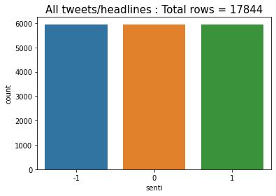

# TeslaSenti
Near real time sentiment analysis of Tesla tweets.

This is a capstone project for a 5-week workshop conducted by AISC. This project was executed by a team of two members (including myself).

The objective of this project is to fetch tweets about TESLA in real time, analyse them for sentiment and generate a buy/sell signal every hour. This sentiment index is displayed (and refreshed in near real time) on the front end in the form of a graph.

Languages/packages used :
* Tweepy
* python
* html
* css
* nltk
* plotly

# Table of contents
1. [Introduction](#Introduction)
2. [Data](#Data)
3. [Anatomy of a tweet](#Anatomy-of-a-tweet)
3. [Conclusion and future work](#Conclusion-and-future-work)
4. [References](#References)

## Introduction

A multiprocessing approach is employed because fetching the tweets, preprocessing/analysing them and serving the requests has to be done
simultaneously. Process p1 fetches the tweets and writes them to a csv file. Process p2 cleans the tweets, runs the sentiment predictor, generates the sentiment
index graph and refreshes the html page every N (=5) minutes. On refresh the graph along with four latest significant tweets are displayed. The page also displays if the latest signal is buy or sell (or hold) based on the latest value of sentiment index.

The user interface is very basic. There is a TESLA logo. The main body of the page shows 4 tweets. These are clickable. The user can click and visit the respective twitter page.

We trained a Naive Bayes model to identify sentiment of financial headlines. For this we used 4845 financial phrase bank Kaggle dataset and 1100 FiQA financial tweets and headlines dataset. These are labelled datasets (Negative, Neutral and Positive). We trained the Naive Bayes model on 80% of the dataset. It performed well on the test dataset (85% accuracy). The model mislabelled many positive tweets as negative and vice versa. The tweets about Tesla were about varied topics like energy, battery, cars and also politics. 

## Data

We combined data from various sources to obtain a labelled dataset.

1) Financial news headlines (Please see the Kaggle reference).

2) FiQA headlines : This dataset is a part of an open challenge posed in 2018. The training dataset contains headlines from the finance domain which are annotated by a sentiment score. This labeling is done by domain experts. The sentiment score is a continuous value between -1 and 1. We chose a threshold of 0.15 to discretize this sentiment score. Headlines with sentiment scores between -1 and -0.15 are labeled as negative sentiment, those between -0.15 and 0.15 are labelled as neutral and those between 0.15 and 1.0 are labeled as positive sentiment (Please see fiqa reference).

3) FiQA posts : Same as (2) above except that posts from blogs etc from financial domains are labelled rather than headlines (Please see fiqa reference).

4) Tweets downloaded using the twitter API.

5) Financial headlines downloaded from tiingo.

6) Tweets downloaded using the twitter API.

7) Reviews of google apps : This dataset was constructed by Venelin Valkov (Please see the curiousily.com reference). It can be downloaded by,

<code> !gdown --id 1S6qMioqPJjyBLpLVz4gmRTnJHnjitnuV </code>

<code> !gdown --id 1zdmewp7ayS4js4VtrJEHzAheSW-5NBZv </code>

8) Financial tweets from stocktwits.

The combined dataset is balanced.

## Anatomy of a tweet
The tweet JSON object has a very rich payload. It contains information ranging from username, date and time, location, profile bio, number of friends and followers, whether the tweet is a  retweet, whether the tweet is a reply etc.

The existence of the <code>retweeted_status</code> token in json string indicates that the tweet is a retweet. A reply to a tweet has <code>in_reply_to_status_id</code> value not null. The <code>is_quote_status</code> field is true for tweets which quoted tweets. Retweets, replies and quoted tweets are eliminated at the top level (i.e. they are not written to file). The retweet count is used as a weight for the sentiment index and hence retweets should not be (double) counted. Replies and quoted tweets have context and are hence hard to analyse for sentiment.

If the tweet contains more than 140 characters, then the <code>text</code>  contains the truncated tweet. For such tweets, the <code>extended_tweet</code> attribute is present. The <code>full_text</code> key contains the whole text of the tweet. 

The following fields from the <code>tweet</code> object are extracted,

* <code>text</code>
* <code>created_at</code>
* <code>retweet_count</code>
* <code>favorite_count</code>

In case the <code>extended_tweet</code> is available the <code>full_text</code> is extracted. The following fields from the <code>user</code> object are extracted,

* <code>name</code>
* <code>screen_name</code>
* <code>id</code>
* <code>verified</code>
* <code>followers_count</code>
* <code>friends_count</code>
* <code>url</code>
* <code>source</code>

The <code>retweet_count</code>, <code>favorite_count</code>, <code>followers_count</code> and <code>friends_count</code> is used to amplify the sentiment index by using these as weights. These weights quantify the reach/impact/engagement of the particular tweet. Since the tweets are streaming for most tweets both <code>retweet_count</code> and <code>favorite_count</code> are zero.

## Tweet cleaning / preprocessing

Tweets with too many cashtags are dropped. We noticed that most of such tweets are advertisements. An example of such a tweet is shown below. It has 13 cashtags ($fb, $aapl, $amzn, etc) and is clearly an advertisement.

## Tips
Command to display csv file on linux/ubuntu command line :

<code>>> cat streaming_tweets_save.csv | column -t -s, | less -S </code>

Another convenient utility is csvtool. This can be installed in ubuntu with,

<code>>> sudo apt-get install -y csvtool </code>

A few selecetd columns can be displayed with,

<code>>> csvtool col 1,2,7 streaming_tweets_save.csv </code>

PEP8 compliance can be checked with,

<code>>> flake8 yourcode.py </code>

flake8 can be installed with,

<code>>> sudo apt install flake8</code>

## Conclusion and future work

A MVP has been demonstrated.

A major hurdle to obtaining good quality predicitions on streaming tweets in the amount of labelled data which goes into training the model. Hand labeling tweets/headlines by sentiments is a tedious tasks. The publicly available sentiment labelled data (resturant reviews etc) is not useful because one needs text from the domain of finance/stocks to train the model. A possible approach to circumventing the need for labeling is as follows. The archive of stock price movements of Tesla and the tweets about Tesla can be downloaded. Then a model can be trained with the tweets as inputs and the stock price movement as the target. The labels in this approach are the stock price movements. These can be readily computed by subtracting (or dividing) successive prices at regular interval. The interval could be few minutes to few hours (or even days).

## References 

Malo, P., Sinha, A., Korhonen, P., Wallenius, J., & Takala, P. (2014). Good debt or bad debt: Detecting semantic orientations in economic texts. Journal of the Association for Information Science and Technology, 65(4), 782-796.

https://www.kaggle.com/ankurzing/sentiment-analysis-for-financial-news

https://sites.google.com/view/fiqa

https://tiingo.com

https://curiousily.com/posts/sentiment-analysis-with-bert-and-hugging-face-using-pytorch-and-python/

https://towardsdatascience.com/create-dataset-for-sentiment-analysis-by-scraping-google-play-app-reviews-using-python-ceaaa0e41c1

https://stocktwits.com

https://stackabuse.com/accessing-the-twitter-api-with-python/

http://adilmoujahid.com/posts/2014/07/twitter-analytics/

https://developer.twitter.com/en/docs/twitter-api/v1/data-dictionary/overview/intro-to-tweet-json

https://developer.twitter.com/en/docs/twitter-api/v1/tweets/filter-realtime/api-reference/post-statuses-filter

http://docs.tweepy.org/en/latest/extended_tweets.html

https://www.tweetbinder.com/blog/twitter-impressions/

https://www.python.org/dev/peps/pep-0008/

