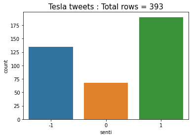
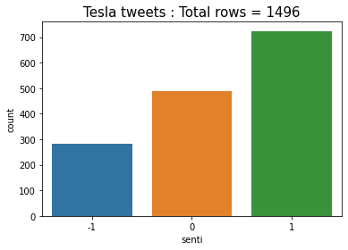

# TeslaSenti
Near real-time sentiment analysis of Tesla tweets.

This is a capstone project for a workshop conducted by AISC. This project was executed by a team of two members (including myself).

The objective of this project is to fetch tweets about TESLA in real time, analyse them for sentiment and generate a buy/sell signal every hour.

Languages/packages used :
* Tweepy
* python
* html
* css

# Table of contents
1. [Introduction](#Introduction)
2. [Anatomy of a tweet](#Anatomy of a tweet)
3. [Conclusion](#Conclusion)
4. [References](#References)

## Introduction

A multiprocessing approach is employed because fetching the tweets, preprocessing/analysing them and serving the requests has to be done
simultaneously. Process p1 fetches the tweets and writes them to a csv file. Process p2 cleans the tweets, runs the sentiment predictor, generates the sentiment
index graph and refreshes the html page every N (=5) minutes. On refresh the graph along with four latest significant tweets are displayed. The page also displays if the latest signal is buy or sell (or hold) based on the latest value of sentiment index.

The user interface is very basic. There is a TESLA logo. The main body of the page shows 4 tweets. These are clickable. The user can click and visit the respective twitter page.

We trained a Naive Bayes model to identify sentiment of financial headlines. For this we used 4845 financial phrase bank Kaggle dataset and 1100 FiQA financial tweets and headlines dataset. These are labelled datasets (Negative, Neutral and Positive). We trained the Naive Bayes model on 80% of the dataset. It performed well on the test dataset (85% accuracy). The model mislabelled many positive tweets as negative and vice versa. The tweets about Tesla were about varied topics like energy, battery, cars and also politics. 
 

## Anatomy of a tweet
The tweet JSON object has a very rich payload. It contains information ranging from username, date and time, location, profile bio, number of friends and followers, whether the tweet is a  retweet, whether the tweet is a reply etc.

The existence of the <code>retweeted_status</code> token in json string indicates that the tweet is a retweet. A reply to a tweet has <code>in_reply_to_status_id</code> value not null. The <code>is_quote_status</code> field is true for tweets which quoted tweets. Retweets, replies and quoted tweets are eliminated at the top level (i.e. they are not written to file). The retweet count is used as a weight for the sentiment index and hence retweets should not be (double) counted. Replies and quoted tweets have context and are hence hard to analyse for sentiment.

If the tweet contains more than 140 characters, then the <code>text</code>  contains the truncated tweet. For such tweets, the <code>extended_tweet</code> attribute is present. The <code>full_text</code> key contains the whole text of the tweet. 

The following fields from the <code>tweet</code> object are extracted,

* <code>text</code>
* <code>created_at</code>
* <code>retweet_count</code>
* <code>favorite_count</code>

In case the <code>extended_tweet</code> is available the <code>full_text</code> is extracted. The following fields from the <code>user</code> object are extracted,

* <code>name</code>
* <code>screen_name</code>
* <code>id</code>
* <code>verified</code>
* <code>followers_count</code>
* <code>friends_count</code>
* <code>url</code>
* <code>source</code>

The <code>retweet_count</code>, <code>favorite_count</code>, <code>followers_count</code> and <code>friends_count</code> is used to magnify the sentiment index by using these as weights. Since the tweets are streaming most probably both <code>retweet_count</code> and <code>favorite_count</code> are zero.

## Tweet cleaning / preprocessing

Tweets with too many cashtags are dropped. I noticed that most of such tweets are advertisements. An example of such a tweet is shown below. It has 13 cashtags ($fb, $aapl, $amzn, etc) and is clearly an advertisement.

## Tips
Command to display csv file on linux/ubuntu command line :

<code>>> cat streaming_tweets_save.csv | column -t -s, | less -S </code>

Another convenient utility is csvtool. This can be installed in ubuntu with,

<code>>> sudo apt-get install -y csvtool </code>

A few selecetd columns can be displayed with,

<code>>> csvtool col 1,2,7 streaming_tweets_save.csv </code>

## Conclusion

## References 

Malo, P., Sinha, A., Korhonen, P., Wallenius, J., & Takala, P. (2014). Good debt or bad debt: Detecting semantic orientations in economic texts. Journal of the Association for Information Science and Technology, 65(4), 782-796.
https://www.kaggle.com/ankurzing/sentiment-analysis-for-financial-news

https://sites.google.com/view/fiqa

https://stackabuse.com/accessing-the-twitter-api-with-python/

http://adilmoujahid.com/posts/2014/07/twitter-analytics/

https://developer.twitter.com/en/docs/twitter-api/v1/data-dictionary/overview/intro-to-tweet-json

https://developer.twitter.com/en/docs/twitter-api/v1/tweets/filter-realtime/api-reference/post-statuses-filter

http://docs.tweepy.org/en/latest/extended_tweets.html

