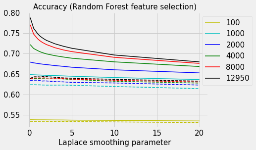

# TeslaSenti
Near real time sentiment analysis of streaming Tesla tweets with application to stock trading. This project is basically a classification problem in Natural Language Processing (NLP).

<!-- This started as a capstone project for a 5-week workshop conducted by Aggregate Intellect's workshop in June, 2020, with two team members. --> The objective of this project is to fetch tweets about TESLA in real time, analyse them for sentiment and generate a buy/sell signal in near real-time. This sentiment index is displayed (and refreshed in near real time) on the front end in the form of a graph. This app is deployed locally. This is a two member team project.

Languages/packages used :
* Tweepy
* python
* html
* css
* nltk
* plotly
* flask
* unittest
* flake8
* conda

# Table of contents
1. [Introduction](#Introduction)
2. [Data](#Data)
3. [Anatomy of a tweet](#Anatomy-of-a-tweet)
4. [Preprocessing of data and training](#Preprocessing-of-data-and-training)
5. [Feature selection](#Feature-selection)
6. [App](#App)
7. [Future work](#Future-work)
8. [References](#References)
9. [Appendex](#Appendex)

## Introduction

Stock trading can be a lucrative profession if a trader can predict whether a particular stock will increase or decrease in price. Based on this prediction the trader buys or sells the stock of a particular company. Buying (borrowing) stock in anticipation of price going up (down) is also known as going long (short). The stock price of any company is influenced by several factors. Modeling and predicting the stock price using all the relevant factors is / has been an active area of research.

One of the important factors is the public sentiment about the particular stock. It has been found that the stock market is heavily influenced by news/social media sentiment on short timescales (hours to days)  [[1]](#1). The news/social media includes blog, twitter [[2]](#2), comments made on news article, opinions expressed in polls, likes/dislikes/number of views of youtube videos etc. Stock traders are increasingly dependent on Machine Learning and AI to get insights into sentiments about the stock in near real time.

In this project a product which generates a buy/sell signal in near real-time for Tesla stock using sentiment analysis of tweets regarding Tesla is demonstrated. Tesla is chosen because it is one of the highly discussed companies. This results in a high volume of tweets - of about 10000 per day. This is convenient to demonstrate near real-time functionality. Though Tesla and its CEO Elon Musk has a cult following, it has a significant number of critics. The cult following includes the fans of Elon Musk and the teslanaires. Tesla itself lies at the intersection of car industry, battery technology, renewable energy and auto driving technology (not to mention politics). This makes the discussion and opinions expressed very varied and lively. 

A *multiprocessing approach* using three processors (p1,p2,p3) which carry out different tasks is employed. Multiprocessing is required because fetching the streaming tweets, preprocessing/analysing them for sentiment and serving the requests has to be done simultaneously. Process p1 fetches the tweets and writes them (along with its features like username etc) to a csv file. Process p2 cleans the tweets, runs the sentiment predictor over each tweet and writes the sentiment index to csv file. Process p3 reads in the latest tweets and their sentiment indices, generates a graph and displays it on the the front end. It also displays four latest tweets. These are clickable. The trader/user can click and visit the respective twitter page or news portal.

## Data

Data from following sources are combined to obtain a dataset. Some of these are hand labelled. Labelled datasets such as restaurant reviews, movie reviews etc are not very useful to train a model which is supposed to classify texts related to finance/stocks. This is because the field of finance/stocks/business has its own unique vocabulary. For example buy, bullish, long are positive words while sell, bearish, short are negative words. Therefore a dataset is generated by combining different labelled datasets mostly related to stock market.

1) Financial news headlines (FinancialPhraseBank)  [[3]](#3), [[4]](#4).

2) FiQA headlines : This dataset [[5]](#5),  is a part of an open challenge posed in 2018. The training dataset contains headlines from the finance domain which are annotated by a sentiment score. This labeling is done by domain experts. The sentiment score is a continuous value between -1 and 1. A threshold of 0.15 is chosen to discretize this sentiment score. Headlines with sentiment scores between -1 and -0.15 are labeled as negative sentiment, those between -0.15 and 0.15 are labelled as neutral and those between 0.15 and 1.0 are labeled as positive sentiment.

3) FiQA posts : Same as (2) above except that posts from blogs etc from financial domains are labelled rather than headlines.

4) Tweets related to finance/stocks downloaded using the twitter API [[6]](#6).

5) Financial headlines downloaded from tiingo [[7]](#7).

6) Tweets with keyword *tesla* downloaded using the twitter API [[6]](#6).

7) Reviews of google apps : This dataset was constructed by Venelin Valkov [[8]](#8). It can be downloaded by,

&nbsp;&nbsp;&nbsp;&nbsp;&nbsp;&nbsp;&nbsp;&nbsp;<code> !gdown --id 1S6qMioqPJjyBLpLVz4gmRTnJHnjitnuV </code>

&nbsp;&nbsp;&nbsp;&nbsp;&nbsp;&nbsp;&nbsp;&nbsp;<code> !gdown --id 1zdmewp7ayS4js4VtrJEHzAheSW-5NBZv </code>

8) Financial tweets from stocktwits  [[9]](#9).

The combined dataset is balanced as shown by the histogram in the middle panel. The left panel shows top few words (strongly) related with the negative sentiment. These are identified using the *chi2* test [[10]](#10), [[11]](#11), [[12]](#12). The right panel shows those  (strongly) related with the positive sentiment class.

## Anatomy of a tweet
The twitter streaming API ([[13]](#13), [[14]](#14)) is used in the application.
The tweet JSON object has a very rich payload [[15]](#15) [[16]](#16)). It contains information ranging from username, date and time, location, profile bio, number of friends and followers, whether the tweet is a  retweet, whether the tweet is a reply etc.

The existence of the <code>retweeted_status</code> token in json string indicates that the tweet is a retweet. A reply to a tweet has <code>in_reply_to_status_id</code> value not null. The <code>is_quote_status</code> field is true for tweets which quoted tweets. Retweets, replies and quoted tweets are eliminated at the top level (i.e. they are not written to file). The retweet count is used as a weight for the sentiment index and hence retweets should not be (double) counted. Replies and quoted tweets have context and are hence hard to analyse for sentiment.

If the tweet contains more than 140 characters, then the <code>text</code>  contains the truncated tweet. For such tweets, the <code>extended_tweet</code> attribute is present. The <code>full_text</code> key contains the whole text of the tweet. 

The following fields from the <code>tweet</code> object are extracted,

* <code>text</code>
* <code>created_at</code>
* <code>retweet_count</code>
* <code>favorite_count</code>

In case the <code>extended_tweet</code> is available the <code>full_text</code> is extracted. The following fields from the <code>user</code> object are extracted,

* <code>name</code>
* <code>screen_name</code>
* <code>id</code>
* <code>verified</code>
* <code>followers_count</code>
* <code>friends_count</code>
* <code>url</code>
* <code>source</code>

## Preprocessing of data and training

The same preprocessing is applied to the data during training of the model and to the streaming tweets in the live app (before model inference). During training, the same cleaning process is applied to the headlines, reviews, posts and tweets though most of the cleaning operations are important only for tweets. For example emojis and urls are never present in newspaper headlines. The streaming tweets with either of tokens *tesla*, *tsla*, *elon* and *musk* are collected for the live app. 

Firstly, tweets with too many cashtags are dropped. It is noticed that most of such tweets are advertisements. An example of such a tweet is shown below. It has 13 cashtags ($fb, $aapl, $amzn, etc) and is clearly an advertisement.

If emoji's and url's are present these are purged from tweets. Hastags, cashtags, mentions and embedded charts are removed. Punctuations, digits, symbols and stop word are removed and the tokens are stemmed. Finally the empty tweets are removed. It is possible that after the cleaning is done some tweets end up with zero tokens. These are purged.

One of the issues is that some irrelevant tweets are included. This is because *musk* is one of the tokens used in the criterion to filter streaming tweets. Since *musk* has a dictionary meaning apart from being Elon's last name some tweets not relevant to Tesla are included in the sentiment analysis. An example of such a tweet is shown below. A possible solution to this problem is to delete the token *musk* from the filter criterion. Another issue is the inclusion of tweets which are not directly relevant to Tesla. A substantial portion of such tweets are of personal nature directed at Elon Musk. An example of such a tweet is shown below. It was decided to drop tokens *elon* and  *musk* from the filter criteria of the streaming tweets. This eliminates frivolous tweets but at the same time also eliminates some bonafide tweets which are closely related to Tesla.

A Naive Bayes (NB) model is trained to identify the sentiment of the text [[17]](#17).  Bag-of-words (BoW) technique is used for feature extraction.  NB model applies the Bayes theorem with the additional assumption that features are independent given the class [[18]](#18). Inspite of this assumption being violated in many applications, NB model has been shown to perform very well in practice.  According to the Bayes equation the posterior probability of a class is proportional to the product of conditional probability of the feature vector given the class and the prior probability of the class. Since in this case the classes are balanced the prior is uniform and hence does not have an impact on classification. The naive assumption of conditional independence allows one to write this conditional probability as a product of conditional probabilities of individual features given the class. The conditional probabilities of individual features are calculated from training data by treating each as a multinomial distribution. However, during the model inference it is possible that a token not included in the training set is included in the document. If the conditional probability of this token is taken to be zero then the product of conditional probabilities evaluates to zero. This problem is circumvented by using additive smoothing. A term *alpha* is added to the numerator of the conditional probabilty and a term *Nxalpha* is added to the denominator where N is the dimensionality of the feature vector. *alpha=1* is known as Laplace smoothing and *alpha<1* is known as Lidstone smoothing. *alpha* has a regularizing effect on the model.

The total number of texts are divided into two groups - 67% for training and 33% for testing (hold out set). The 67% is used for K-fold cross validation. The hyperparameter *alpha* is tuned using cross validation. The GridSearchCV() function is used to identify the best value of alpha amongst (0.1, 0.5, 1.0, 3.0, 5.0, 10.0, 50.0, 1e2, 1e3, 1e4).  The mean train and test accuracies from the cross validation are shown in the graph below. The highest mean test accuracy of 0.647 is realized for alpha=1.0. The corresponding mean train accuracy is 0.76. For alpha=0.0 the train and test accuracy is 0.81 and 0.64. Increasing the value of alpha to 1.0 decreases the overfit but further increasing alpha decreases the accuracy. This is because higher values of alpha lead to underfitting. Hence the model with alpha=1.0 is saved and used for inference in the deployed model. 

The saved model results in an accuracy of 0.66 for the hold out set. The following table shows some important scores [[19]](#19) for the hold out set.

| *sentiment* | *precision* |*Recall*  | *F1*   | 
|:-----------:|:-----------:|:--------:|:-------:
|**-1**       | 0.67        |  0.75    | 0.71   | 
|**0**        | 0.67        |  0.62    | 0.65   | 
|**1**        | 0.64        |  0.61    | 0.63   | 

Recall (also known as sensivity) is defined as TP/(Actual positive) = TP/(TP+FN).
Precision (also known as positive predictive value) is defined as TP/(Predicted positives) = TP/(TP+FP).
Consider the negative sentiment class. Out of all the actual negative tweets 75% are correctly identified as negative. The precision is 0.67. Out of all the tweets labelled as negative only 67% are actually negative. Therefore 33% of tweets labeled as negative are actually positive or neutral. This means that 33% of the times the trader will incorrectly decide to sell when actually the correct decision would be to either hold or buy. Approximately, all the metrics are in 60s. There is substantial headroom to improve the model. In so far as overfitting is concerned one way to ameliorate it is to use more (in number and diversity) data. However hand labelling financial text for sentiment is an onerous task.

Experiments were carried out with two more models - LinearSVC and LogisticRegression [[12]](#12). However the results (in terms of test metrics and also overfitting) obtained were similar to those obtained using Naive Bayes. An important avenue that could be explored is using a deep learning model such as BERT [[20]](#20). However, typically deep learning models are data hungry and therefore the current size of training data might not suffice. Another approach to model improvement involves decreasing the vocabulary size by choosing the most important tokens (i.e. feature importance) by using chi2 [[12]](#12).

The Naive Bayes model outputs the probability of each class given a sample. This probability can be used as a threshold to decide if the label of -1 (+1) should be accepted for decision making (buy/sell). However Naive Bayes is known to be a good classifier but bad estimator [[18]](#18). The probabilities calculated by Naive Bayes are not reliable.

## Feature selection

## App

Flask is used for the backend. Flask is a micro-framework. For example, it does not have database abstraction layer. This and many other features can be added as an addon using libraries. The front end is designed using html and CSS. The backend code reads in the csv file with the datestamps, tweet and the sentiment index. It uses the plotly library to generate graphs of the sentiment index with the time on the xaxis. Two different graphs are generated. The left panel shows the sentiment index going back 24 hours from current time and the right side panel shows the same going back one hour. For the left side panel the average of sentiment index over one hour buckets are shown. For the right side panel the average of the sentiment index over 5 minute bucket is shown. A positive sentiment index is a buy signal while a negative value is sell signal. The latest four tweets are shown below this graph. The trader can click on it and go to the webpage of the tweet or the embedded news article.

The refresh rate of the front end is controlled by using meta refresh. The HTML meta element is used with <code>http-equiv</code> parameter set to *refresh* and the <code>content</code> parameter equal to 120 seconds. This is the refresh time frequency.

The pipeline consists of three processors working in parallel. Process p1 fetches the tweets and writes them (along with its features like username etc) to a csv file.
Processor p2 reads in the latest tweets (since the last read), cleans the tweets and runs the sentiment model which labels each tweet as negative (-1), neutral (0) or positive (+1). This sentiment index is multiplied by a weight which depends on the <code>verified</code> user status, <code>retweet_count</code>, <code>favorite_count</code>, <code>followers_count</code> and <code>friends_count</code>. These weights quantify the reach/impact/engagement ([[21]](#21)) of the particular tweet. Since the tweets are streaming, for most tweets both <code>retweet_count</code> and <code>favorite_count</code> are zero. A factor of (5 x number of retweet+favs) is used as a weight. The number of friends/followers can be large for some users. Therefore log10(followers+friends) is used as weight if the number is more than 10. (A dataset of streaming tweets is explored. It is found that only 152 out of 7258 have a verified account !) It is rare for a user to be a verified one. In such a case a factor of 2 is used to amplify the sentiment index. The weighted sentiment index so obtained is used in the graphs plotted and displayed by the app. Processor p2 writes the latest tweets and the weighted sentiment indices to another csv file. Processor p3 reads the latest tweets, sentiment indices of the these tweets, generates the graphs and refreshes the front end in real time.

A screenshot of the app frontend is shown below. The scrollbar and two tweets are cropped off and hence are not visible. The negative values of sentiment index starting at about 22:00, 11 January 2021 corresponds to the drop in Tesla stock from $850 USD. The positive values starting from 08:00, 12 January 2021 coincides with the entry of Tesla in the Indian market with the announcement that Tesla has officially registered with the Registrar of companies in India and had appointed three directors for its India operation. The frontend can be improved considerably. The zeroline on each of the graphs has to be highlighted. This could be done by shading the bottom half (below zero) of the graph in red and the top half by green. The trader can easily see if the sentiment index is in the buy zone or the sell zone. As new tweets stream in this graph is refreshed every 2 minutes.

## Future work

A MVP has been demonstrated. The heart of this product is the sentiment prediction model. Though other components like the frontend and details of the database system are important the sentiment model assumes primacy. This is because if the sentiment model  mislabels a tweet it can potentially lead to a loss. Therefore,  another (better) model could be trained. Apart from improving the scores given by the Naive Bayes one would like to obtain reliable probabilities of classes. This is because these probabilities can be used to improve decision making. One way of using these probabilities  is to use these as a threshold. For example a negative (or positive tweet) would result in an action of sell (or buy) only if the probability is > 0.8. Another way is to use the probability as a weight. In this case the sentiment index will be w1*(-1)+w2*(+1) where w1 and w2 are the probabilities outputed by the model for the particular sample.

(1) A major hurdle to obtaining good quality predicitions on streaming tweets is the amount of labelled data which goes into training the model. Hand labeling tweets/headlines by sentiments is a tedious tasks. The publicly available sentiment labelled data (resturant reviews etc) is not useful because one needs text from the domain of finance/stocks to train the model. A possible approach to circumventing the need for labeling is as follows. The archive of stock price movements of Tesla and the tweets about Tesla can be downloaded. Then a model can be trained with the tweets as inputs and the stock price movement as the target. The labels in this approach are the stock price movements. These can be readily computed by subtracting (or dividing) successive prices at regular interval. The interval could be few minutes to few hours (or even days).

(2) The frontend interface is very basic. There is scope to make it more attractive for a better user experience. The xaxis of the graphs is time in UTC. This should be made user friendly. The time zone of the user should be automatically detected. Then the relevant time zone should be displayed on the xaxis.

(3) The latest four tweets are shown on the front end. It would be more informative to the trader if only impactful tweets are shown. This can be done by displaying only positive and negative tweets by users with many friends/followers. The number of retweets can also be used as in indication of impactful tweets. However, in real time the number of retweets tends to be zero. The <code>verified</code> flag can be used to identify impactful/bonafide tweets. Another approach is to make a list of most influencial users among the tesla tweeterati. This can be done offline by using the archive of tesla tweets and stock prices. The users whose tweets  on an average correlated well with the movement of tesla stock price can be short listed. The tweets from these users can be given higher weightage in the real time application. Also tweets from these users can be highlighted. This way the trader can immediately know that this tweet is from a tesla influencer.

(4) Some news about tesla is tweeted independently by media houses and individual users. These are not retweets. Such tweets with a common theme, say over a period of one day, can be collapsed into one summary tweet by choosing a representative tweet. This tweet can the be displayed in a corner of the frontend as the *tweet of the day*. This way the trader would know the trending topic of the day. Also this would ensure that  repetitive tweets about the same topic are not displayed on the frontend. Such near duplicate tweets could lead to reader fatigue. An example is *'Musk says its impossible to take Tesla private, mulls new IPO'*. This news was tweeted by several users on 15 December, 2020.

(5) A more engaging graph could be presented by allowing the respective tweet to be shown if the user hovers over a particular point on the graph.

(6) The data preprocessing should include removal of tweets with expletives / profane language. It should also filter out tweets with obscene images. It is noticed that some tweets which are advertisements are making through the preprocessing filters. One could improve the filtering by eliminating tweets with keywords like *signup*, *free*, etc. Another issue in preprocessing is that of stemming versus lemmatizing. Porter stemming is used. It is possible that lemmatizing instead of stemming can have a positive impact on the scores [[22]](#22). However a study [[23]](#23) shows that stemming versus lemmatization does not have significant impact on text classification.

(7) Use SQL database rather than csv files.

(8) Deploy app on cloud (AWS / Azure / Heroku).

(9) In practice a trader will not rely on market sentiment alone to make a buy/sell decision. He/she would look at prediciton from a conventional model which includes various factors like correlation of tesla stock value with other stocks etc. Time series models are usually developed for this purpose. There is scope to integrate a sentiment analysis model with a conventional model. Such a combined model would generate a buy/sell signal taking into consideration all factors including sentiment.

(10) Documentation using Sphinx [[24]](#24).

## References 

<a id="1">[1]</a>
Bartov, E., Faurel, L., & Mohanram, P. S. (2018). Can twitter help predict firm-level earnings and stock returns? Accounting Review, 93(3), 25-57. https://doi.org/10.2308/accr-51865

<a id="2">[2]</a>
Ranco G, Aleksovski D, Caldarelli G, Grčar M, Mozetič I (2015) The Effects of Twitter Sentiment on Stock Price Returns. PLoS ONE 10(9): e0138441. https://doi.org/10.1371/journal.pone.0138441

<a id="3">[3]</a>
Malo, P., Sinha, A., Korhonen, P., Wallenius, J., & Takala, P. (2014). Good debt or bad debt: Detecting semantic orientations in economic texts. Journal of the Association for Information Science and Technology, 65(4), 782-796.

<a id="4">[4]</a>
https://www.kaggle.com/ankurzing/sentiment-analysis-for-financial-news

<a id="5">[5]</a>
https://sites.google.com/view/fiqa

<a id="6">[6]</a>
https://developer.twitter.com/en/docs/twitter-api

<a id="7">[7]</a>
https://tiingo.com

<a id="8">[8]</a>
https://towardsdatascience.com/create-dataset-for-sentiment-analysis-by-scraping-google-play-app-reviews-using-python-ceaaa0e41c1

<a id="9">[9]</a>
https://stocktwits.com

<a id="10">[10]</a>
http://ethen8181.github.io/machine-learning/text_classification/chisquare.html

<a id="11">[11]</a>
http://blog.datumbox.com/using-feature-selection-methods-in-text-classification/

<a id="12">[12]</a>
https://towardsdatascience.com/multi-class-text-classification-with-scikit-learn-12f1e60e0a9f

<a id="13">[13]</a>
https://stackabuse.com/accessing-the-twitter-api-with-python/

<a id="14">[14]</a>
http://adilmoujahid.com/posts/2014/07/twitter-analytics/

<a id="15">[15]</a>
https://developer.twitter.com/en/docs/twitter-api/v1/data-dictionary/overview/intro-to-tweet-json

<a id="16">[16]</a>
http://docs.tweepy.org/en/latest/extended_tweets.html

<a id="17">[17]</a>
https://sebastianraschka.com/Articles/2014_naive_bayes_1.html

<a id="18">[18]</a>
https://scikit-learn.org/stable/modules/naive_bayes.html

<a id="19">[19]</a>
https://towardsdatascience.com/accuracy-precision-recall-or-f1-331fb37c5cb9

<a id="20">[20]</a>
https://curiousily.com/posts/sentiment-analysis-with-bert-and-hugging-face-using-pytorch-and-python/

<a id="21">[21]</a>
https://www.tweetbinder.com/blog/twitter-impressions/

<a id="22">[22]</a>
https://towardsdatascience.com/stemming-lemmatization-what-ba782b7c0bd8

<a id="23">[23]</a>
M. Toman, R. Tesar, and K. Jezek, “Influence of word normalization on text classification,” Proceedings of InSciT, pp. 354–358, 2006.

<a id="24">[24]</a>
https://sphinx-rtd-tutorial.readthedocs.io/en/latest/docstrings.html

<!--  https://www.python.org/dev/peps/pep-0008/ -->

<!--  https://towardsdatascience.com/apply-and-lambda-usage-in-pandas-b13a1ea037f7 -->

<!-- https://medium.com/@vibhuti.siddhpura/machine-learning-algorithms-introduction-fb86623c5218 -->

## Appendex
Command to display csv file on linux/ubuntu command line :  
&nbsp; &nbsp; &nbsp; &nbsp; &nbsp; &nbsp; &nbsp; &nbsp; &nbsp; &nbsp; &nbsp; &nbsp; &nbsp; &nbsp; &nbsp; &nbsp; &nbsp; &nbsp; &nbsp; &nbsp; &nbsp; 
<code>>> cat streaming_tweets_save.csv | column -t -s, | less -S </code>

Another convenient utility is csvtool. This is installed in ubuntu with, 
&nbsp; &nbsp; &nbsp; &nbsp; &nbsp; &nbsp; &nbsp; &nbsp; &nbsp; &nbsp; &nbsp; &nbsp; &nbsp; &nbsp; &nbsp; &nbsp; &nbsp; &nbsp; &nbsp; &nbsp; &nbsp; 
<code>>> sudo apt-get install -y csvtool </code>

A few selected columns can be displayed with, 
&nbsp; &nbsp; &nbsp; &nbsp; &nbsp; &nbsp; &nbsp; &nbsp; &nbsp; &nbsp; &nbsp; &nbsp; &nbsp; &nbsp; &nbsp; &nbsp; &nbsp; &nbsp; &nbsp; &nbsp; &nbsp; 
<code>>> csvtool col 1,2,7 streaming_tweets_save.csv </code>

PEP8 compliance is checked with, 
&nbsp; &nbsp; &nbsp; &nbsp; &nbsp; &nbsp; &nbsp; &nbsp; &nbsp; &nbsp; &nbsp; &nbsp; &nbsp; &nbsp; &nbsp; &nbsp; &nbsp; &nbsp; &nbsp; &nbsp; &nbsp; 
<code>>> flake8 yourcode.py </code>

flake8 is installed with, 
&nbsp; &nbsp; &nbsp; &nbsp; &nbsp; &nbsp; &nbsp; &nbsp; &nbsp; &nbsp; &nbsp; &nbsp; &nbsp; &nbsp; &nbsp; &nbsp; &nbsp; &nbsp; &nbsp; &nbsp; &nbsp; 
<code>>> sudo apt install flake8</code>

conda is an environment management system. It can be used to create a consistent enviroment across different systems. Following are some
useful commands. To create a environment, 
&nbsp; &nbsp; &nbsp; &nbsp; &nbsp; &nbsp; &nbsp; &nbsp; &nbsp; &nbsp; &nbsp; &nbsp; &nbsp; &nbsp; &nbsp; &nbsp; &nbsp; &nbsp; &nbsp; &nbsp; &nbsp; 
<code>>> conda env create --file conda.yaml</code>

To list all created environments (active are shown with asterisk),  
&nbsp; &nbsp; &nbsp; &nbsp; &nbsp; &nbsp; &nbsp; &nbsp; &nbsp; &nbsp; &nbsp; &nbsp; &nbsp; &nbsp; &nbsp; &nbsp; &nbsp; &nbsp; &nbsp; &nbsp; &nbsp; 
<code>>> conda env list </code>

To activate environment named conda-tesla, 
&nbsp; &nbsp; &nbsp; &nbsp; &nbsp; &nbsp; &nbsp; &nbsp; &nbsp; &nbsp; &nbsp; &nbsp; &nbsp; &nbsp; &nbsp; &nbsp; &nbsp; &nbsp; &nbsp; &nbsp; &nbsp; 
<code>>> conda activate conda-tesla </code>

To deactivate a currently active environment, 
&nbsp; &nbsp; &nbsp; &nbsp; &nbsp; &nbsp; &nbsp; &nbsp; &nbsp; &nbsp; &nbsp; &nbsp; &nbsp; &nbsp; &nbsp; &nbsp; &nbsp; &nbsp; &nbsp; &nbsp; &nbsp; 
<code>>> conda deactivate</code>

To delete an environment, 
&nbsp; &nbsp; &nbsp; &nbsp; &nbsp; &nbsp; &nbsp; &nbsp; &nbsp; &nbsp; &nbsp; &nbsp; &nbsp; &nbsp; &nbsp; &nbsp; &nbsp; &nbsp; &nbsp; &nbsp; &nbsp; 
<code>>> conda env remove --name conda-tesla</code>

To list the packages loaded and their versions use, 
&nbsp; &nbsp; &nbsp; &nbsp; &nbsp; &nbsp; &nbsp; &nbsp; &nbsp; &nbsp; &nbsp; &nbsp; &nbsp; &nbsp; &nbsp; &nbsp; &nbsp; &nbsp; &nbsp; &nbsp; &nbsp; 
<code>>> pip list</code>  
&nbsp; &nbsp; &nbsp; &nbsp; &nbsp; &nbsp; &nbsp; &nbsp; &nbsp; &nbsp; &nbsp; &nbsp; &nbsp; &nbsp; &nbsp; &nbsp; &nbsp; &nbsp; &nbsp; &nbsp; &nbsp; 
<code>>> pip freeze</code>

