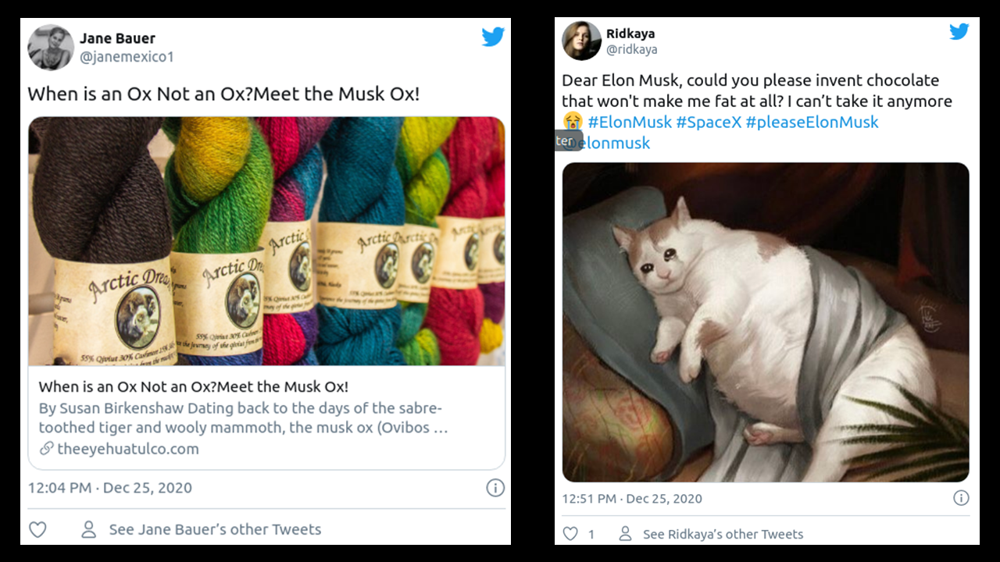

# TeslaSenti
Near real time sentiment analysis of Tesla tweets with application to stock trading.

This started as a capstone project for a 5-week workshop conducted by Aggregate Intellect's workshop in June, 2020, with two team members. The objective of this project is to fetch tweets about TESLA in real time, analyse them for sentiment and generate a buy/sell signal in near real-time. This sentiment index is displayed (and refreshed in near real time) on the front end in the form of a graph. This app is deployed locally.

Languages/packages used :
* Tweepy
* python
* html
* css
* nltk
* plotly
* flask
* unittest
* flake8

# Table of contents
1. [Introduction](#Introduction)
2. [Data](#Data)
3. [Anatomy of a tweet](#Anatomy-of-a-tweet)
4. [Preprocessing of data and training](#Preprocessing-of-data-and-training)
5. [App](#App)
6. [Future work](#Future-work)
7. [References](#References)
8. [Appendex](#Appendex)

## Introduction

Stock trading can be a lucrative profession if a trader can predict whether a particular stock will increase or decrease in price. Based on this prediction the trader buys or sells the stock of a particular company. Buying and selling is also known as going long and going short respectively. The stock price of any company is influenced by several factors. Modeling and predicting the stock price using all the relevant factors is / has been an active area of research.

One of the important factors is the public sentiment about the particular stock. It has been found that the stock market is heavily influenced by news/social media sentiment on short timescales (hours to days)  [[1]](#1). The news/social media includes blog, twitter [[2]](#1), comments made on news article, opinions expressed in polls, likes/dislikes/number of views of youtube videos etc. Stock traders are increasingly dependent on Machine Learning and AI to get insights into sentiments about the stock in near real time.

In this project a product which generates a buy/sell signal in near real-time for Tesla stock using sentiment analysis of tweets regarding Tesla is demonstrated. Tesla is chosen because it is one of the highly discussed companies. This results in a high volume of tweets - of about 10000 per day. This is convenient to demonstrate near real-time functionality. Though Tesla and its CEO Elon Musk has a cult following, it has a significant number of critics. The cult following includes the fans of Elon Musk and the teslanaires. Tesla itself lies at the intersection of car industry, battery technology, renewable energy and auto driving technology (not to mention politics). This makes the discussion and opinions expressed very varied and lively. 

A multiprocessing approach using three processors (p1,p2,p3) which carry out different duties is employed. Multiprocessing is required because fetching the streaming tweets, preprocessing/analysing them for sentiment and serving the requests has to be done simultaneously. Process p1 fetches the tweets and writes them (along with its features like username etc) to a csv file. Process p2 cleans the tweets, runs the sentiment predictor over each tweet and writes the sentiment index to csv file. Process p3 reads in the latest tweets and their sentiment indices, generates a graph and displays it on the the front end. It also displays latest four tweets. These are clickable. The trader/user can click and visit the respective twitter page or new portal.

## Data

Labelled data from various sources are combined to obtain a dataset.

1) Financial news headlines (Please see the Kaggle reference)  [[5]](#1).

2) FiQA headlines : This dataset is a part of an open challenge posed in 2018. The training dataset contains headlines from the finance domain which are annotated by a sentiment score. This labeling is done by domain experts. The sentiment score is a continuous value between -1 and 1. A threshold of 0.15 is chosen to discretize this sentiment score. Headlines with sentiment scores between -1 and -0.15 are labeled as negative sentiment, those between -0.15 and 0.15 are labelled as neutral and those between 0.15 and 1.0 are labeled as positive sentiment (Please see fiqa reference).

3) FiQA posts : Same as (2) above except that posts from blogs etc from financial domains are labelled rather than headlines (Please see fiqa reference).

4) Tweets related to finance/stocks downloaded using the twitter API.

5) Financial headlines downloaded from tiingo.

6) Tweets with keyword *tesla* downloaded using the twitter API.

7) Reviews of google apps : This dataset was constructed by Venelin Valkov (Please see the curiousily.com reference). It can be downloaded by,

&nbsp;&nbsp;&nbsp;&nbsp;&nbsp;&nbsp;&nbsp;&nbsp;<code> !gdown --id 1S6qMioqPJjyBLpLVz4gmRTnJHnjitnuV </code>

&nbsp;&nbsp;&nbsp;&nbsp;&nbsp;&nbsp;&nbsp;&nbsp;<code> !gdown --id 1zdmewp7ayS4js4VtrJEHzAheSW-5NBZv </code>

8) Financial tweets from stocktwits.

The combined dataset is balanced.

## Anatomy of a tweet
The tweet JSON object has a very rich payload. It contains information ranging from username, date and time, location, profile bio, number of friends and followers, whether the tweet is a  retweet, whether the tweet is a reply etc.

The existence of the <code>retweeted_status</code> token in json string indicates that the tweet is a retweet. A reply to a tweet has <code>in_reply_to_status_id</code> value not null. The <code>is_quote_status</code> field is true for tweets which quoted tweets. Retweets, replies and quoted tweets are eliminated at the top level (i.e. they are not written to file). The retweet count is used as a weight for the sentiment index and hence retweets should not be (double) counted. Replies and quoted tweets have context and are hence hard to analyse for sentiment.

If the tweet contains more than 140 characters, then the <code>text</code>  contains the truncated tweet. For such tweets, the <code>extended_tweet</code> attribute is present. The <code>full_text</code> key contains the whole text of the tweet. 

The following fields from the <code>tweet</code> object are extracted,

* <code>text</code>
* <code>created_at</code>
* <code>retweet_count</code>
* <code>favorite_count</code>

In case the <code>extended_tweet</code> is available the <code>full_text</code> is extracted. The following fields from the <code>user</code> object are extracted,

* <code>name</code>
* <code>screen_name</code>
* <code>id</code>
* <code>verified</code>
* <code>followers_count</code>
* <code>friends_count</code>
* <code>url</code>
* <code>source</code>

## Preprocessing of data and training

The streaming tweets with either of tokens *tesla*, *tsla*, *elon* and *musk* are collected. The same cleaning process is applied to  headlines, reviews, posts and tweets though most of the cleaning operations apply to tweets. Also it is important to ensure that the same preprocessing is applied to the data during training of the model and to the streaming tweets in the live app (model inference). 

Tweets with too many cashtags are dropped. We noticed that most of such tweets are advertisements. An example of such a tweet is shown below. It has 13 cashtags ($fb, $aapl, $amzn, etc) and is clearly an advertisement.

If emoji's and url's are present these are purged from tweets. Hastags, cashtags, mentions and embedded charts are removed. Punctuations, digits, symbols and stop word are removed and the tokens are stemmed. Finally the empty tweets are removed. It is possible that after the cleaning is done some tweets end up with zero tokens.

One of the issues is that some irrelevant tweets are included. This is because *musk* is one of the tokens used in the criterion to filter streaming tweets. Since *musk* has a dictionary meaning apart from being Elon's last name some tweets not relevant to Tesla are included in the sentiment analysis. An example of such a tweet is shown below. A possible solution to this problem is to delete the token *musk* from the filter criterion. Another issue is the inclusion of tweets which are not directly relevant to Tesla. A substantial portion of such tweets are of personal nature directed at Elon Musk. An example of such a tweet is shown below. It was decided to drop tokens *elon* and  *musk* from the filter criteria of the streaming tweets. This eliminates frivolous tweets but at the same time also eliminates some bonafide tweets which are closely related to Tesla.

A Naive Bayes model is trained to identify sentiment of financial headlines. 

| *sentiment* | *precision* |*Recall*  | *F1*   | 
|:-----------:|:-----------:|:--------:|:-------:
|**-1**       | 0.66        |  0.72    | 0.69   | 
|**0**        | 0.64        |  0.60    | 0.62   | 
|**1**        | 0.60        |  0.59    | 0.59   | 

## App

Flask is used for the backend. Flask is a micro-framework. For example, it does not have database abstraction layer. This and many other features can be added as an addon using libraries. The front end is designed using html and CSS. The backend code reads in the csv file with the datestamps, tweet and the sentiment index. It uses the plotly library to generate graphs of the sentiment index with the time on the xaxis. Two different graphs are generated. The left panel shows the sentiment index going back 24 hours from current time and the right side panel shows the same going back one hour. For the left side panel the average of sentiment index over one hour buckets are shown. For the right side panel the average of the sentiment index over 5 minute bucket is shown. A positive sentiment index is a buy signal while a negative value is sell signal. The latest four tweets are shown below this graph. The trader can click on it and go to the webpage of the tweet or the embedded news article.

The refresh rate of the front end is controlled by using meta refresh. The HTML meta element is used with <code>http-equiv</code> parameter set to *refresh* and the <code>content</code> parameter equal to 120 seconds. This is the refresh time frequency.

As stated above a multiprocessing strategy is employed. Processor p2 reads in the latest tweets (since the last read), cleans the tweets and runs the sentiment model which labels each tweet as negative (-1), neutral (0) or positive (+1). This sentiment index is multiplied by a weight which depends on the <code>verified</code> user status, <code>retweet_count</code>, <code>favorite_count</code>, <code>followers_count</code> and <code>friends_count</code>. These weights quantify the reach/impact/engagement of the particular tweet. Since the tweets are streaming for most tweets both <code>retweet_count</code> and <code>favorite_count</code> are zero. A factor of (5 x number of retweet+favs) is used as a weight. The number of friends/followers can be large for some users. Therefore log10(followers+friends) is used as weight if the number is more than 10. It is rare for a user to be a verified one. In such a case a factor of 2 is used to amplify the sentiment index. The weighted sentiment index so obtained is used in the graphs plotted and displayed by the app.

## Future work

A MVP has been demonstrated.

(1) A major hurdle to obtaining good quality predicitions on streaming tweets in the amount of labelled data which goes into training the model. Hand labeling tweets/headlines by sentiments is a tedious tasks. The publicly available sentiment labelled data (resturant reviews etc) is not useful because one needs text from the domain of finance/stocks to train the model. A possible approach to circumventing the need for labeling is as follows. The archive of stock price movements of Tesla and the tweets about Tesla can be downloaded. Then a model can be trained with the tweets as inputs and the stock price movement as the target. The labels in this approach are the stock price movements. These can be readily computed by subtracting (or dividing) successive prices at regular interval. The interval could be few minutes to few hours (or even days).

(2) The probability is used as a weight. It could be rather used as threshold. For example a negative or positive tweet would pass through this filter only if the probability is > 0.8.

(3) The frontend interface is very basic. There is scope to make it more attractive for a better user experience.

(4) The latest four tweets are shown on the front end. It would be more informative to the trader if only impactful tweets are shown. This can be done by displaying only positive and negative tweets by users with many friends/followers. The number of retweets can also be used as in indication of impactful tweets. However, in real time the number of retweets tends to be zero. The <code>verified</code> flag can be used to identify impactful/bonafide tweets. Another approach is to make a list of most influencial users among the tesla tweeterati. This can be done offline by using the archive of tesla tweets and stock prices. The users whose tweets  on an average correlated well with the movement of tesla stock price can be short listed. The tweets from these users can be given higher weightage in the real time application. Also tweets from these users can be highlighted. This way the trader can immediately know that this tweet is from a tesla influencer.

(5) Some news about tesla is tweeted independently by media houses and individual users. These are not retweets. Such tweets with a common theme, say over a period of one day, can be collapsed into one summary tweet by choosing a representative tweet. This tweet can the be displayed in a corner of the frontend as the *tweet of the day*. This way the trader would know the trending topic of the day. Also this would ensure that  repetitive tweets about the same topic are not displayed on the frontend. Such near duplicate tweets could lead to reader fatigue. An example is *'Musk says its impossible to take Tesla private, mulls new IPO'*. This news was tweeted by several users.

(6) A more engaging graph could be presented by allowing the respective tweet to be shown if the user hovers over a particular point on the graph.

(7) The data preprocessing should include removal of tweets with expletives / profane language. It should also filter out tweets with obscene images.

(8) Use SQL database rather than csv files.

(9) Deploy app on cloud (AWS / Azure / Heroku).

(10) In practice a trader will not rely on market sentiment alone to made a buy/sell decision. He/she would look at prediciton from a conventional model which includes various factors like correlation of tesla stock value with other stocks etc. Time series models are usually developed for this purpose. There is scope to integrate a sentiment analysis model with a conventional model. Such a combined model would generate a buy/sell signal taking into consideration all factors including sentiment.

## References 

<a id="1">[1]</a>
Bartov, E., Faurel, L., & Mohanram, P. S. (2018). Can twitter help predict firm-level earnings and stock returns? Accounting Review, 93(3), 25-57. https://doi.org/10.2308/accr-51865

<a id="1">[2]</a>
Ranco G, Aleksovski D, Caldarelli G, Grčar M, Mozetič I (2015) The Effects of Twitter Sentiment on Stock Price Returns. PLoS ONE 10(9): e0138441. https://doi.org/10.1371/journal.pone.0138441

<a id="5">[5]</a>
Malo, P., Sinha, A., Korhonen, P., Wallenius, J., & Takala, P. (2014). Good debt or bad debt: Detecting semantic orientations in economic texts. Journal of the Association for Information Science and Technology, 65(4), 782-796.

https://www.kaggle.com/ankurzing/sentiment-analysis-for-financial-news

https://sites.google.com/view/fiqa

https://tiingo.com

https://curiousily.com/posts/sentiment-analysis-with-bert-and-hugging-face-using-pytorch-and-python/

https://towardsdatascience.com/create-dataset-for-sentiment-analysis-by-scraping-google-play-app-reviews-using-python-ceaaa0e41c1

https://stocktwits.com

https://stackabuse.com/accessing-the-twitter-api-with-python/

http://adilmoujahid.com/posts/2014/07/twitter-analytics/

https://developer.twitter.com/en/docs/twitter-api/v1/data-dictionary/overview/intro-to-tweet-json

https://developer.twitter.com/en/docs/twitter-api/v1/tweets/filter-realtime/api-reference/post-statuses-filter

http://docs.tweepy.org/en/latest/extended_tweets.html

https://www.tweetbinder.com/blog/twitter-impressions/

https://www.python.org/dev/peps/pep-0008/

https://towardsdatascience.com/apply-and-lambda-usage-in-pandas-b13a1ea037f7

https://medium.com/@vibhuti.siddhpura/machine-learning-algorithms-introduction-fb86623c5218

## Appendex
Command to display csv file on linux/ubuntu command line :

<code>>> cat streaming_tweets_save.csv | column -t -s, | less -S </code>

Another convenient utility is csvtool. This can be installed in ubuntu with,

<code>>> sudo apt-get install -y csvtool </code>

A few selecetd columns can be displayed with,

<code>>> csvtool col 1,2,7 streaming_tweets_save.csv </code>

PEP8 compliance can be checked with,

<code>>> flake8 yourcode.py </code>

flake8 can be installed with,

<code>>> sudo apt install flake8</code>

